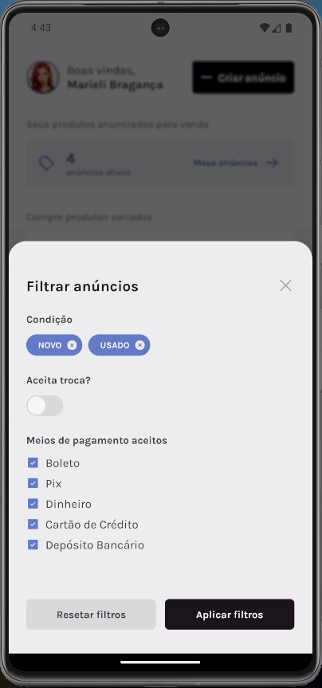
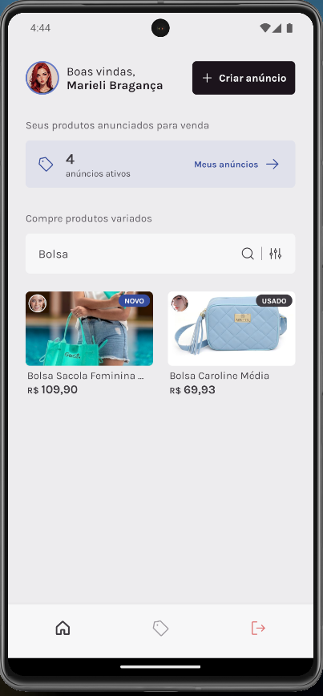
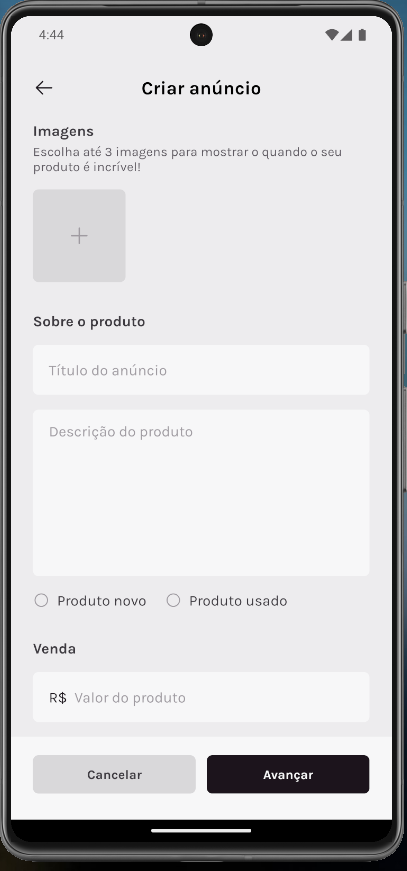
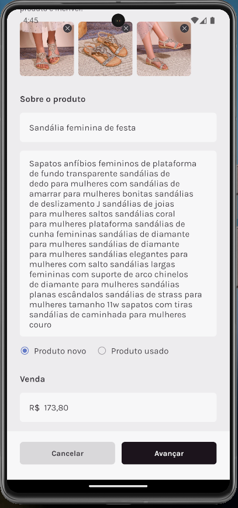
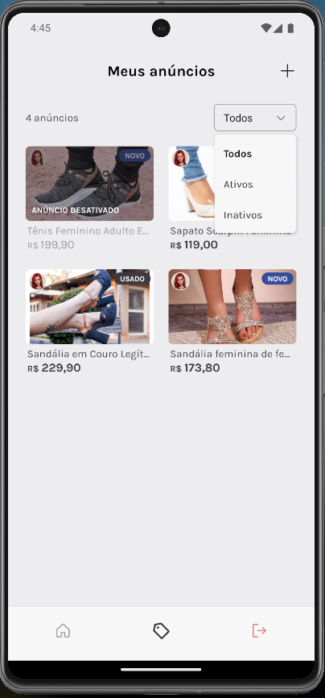
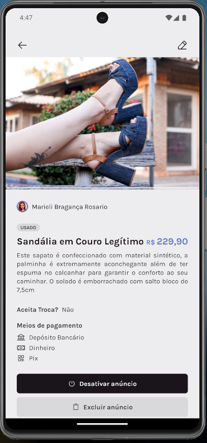
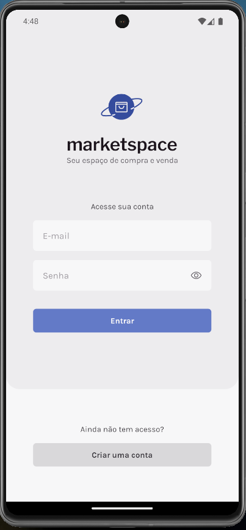
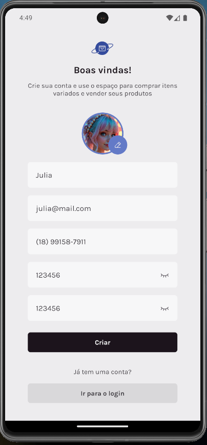

# MarketSpace - React Native App

Welcome to **MarketSpace**, a product marketplace app developed as part of Rocketseat's Ignite React Native Challenge. This app is inspired by platforms like OLX, focusing on product listing and user interaction for buying and selling items.

## Project Demonstration

Check out a full video demonstration of the app in action: [YouTube - MarketSpace App Demo](https://www.youtube.com/watch?v=OlynaLj62Ug)

## About the Challenge

This project is the third challenge in Rocketseat’s Ignite React Native track. The main goal was to practice key concepts from React Native while adding new features and building a complete mobile application using Expo.

### Features Developed

- **User Login and Registration**: Sign in or register as a new user to start creating and managing product listings.
- **Product Management**: Users can create, edit, and delete product listings.
- **Product Search and Filters**: Advanced search functionality with filters such as condition (new or used), accepted payment methods, and more.
- **Multiple Image Upload**: Support for uploading and displaying multiple images for each product.
- **WhatsApp Integration**: Buyers can easily contact sellers via WhatsApp.

### Concepts Covered

- React Native Core Concepts: **States, Context API, API Consumption**
- Form Handling with **React Hook Form and Zod**
- Image Handling and Uploads with **Expo Image Picker**
- Navigation with **React Navigation**
- **Expo Router** for file-based routing
- Filtering and searching for products
- WhatsApp link integration using **React Native Linking API**

## Screenshots

## Tech Stack

This project was built using the following technologies:

- **React Native**
- **Expo**
- **TypeScript**
- **Axios** for API consumption
- **React Hook** Form for form handling
- **Zod** for schema validation
- **Expo Image Picker** for handling image uploads
- **Expo Router** for navigation
- **React Native Reanimated** Carousel for product image carousels
- **Expo File System** for file management
- **React Native Toast Message** for notifications

## API Information

The project consumes a pre-defined API developed by Rocketseat for this challenge. To run the API locally, follow these steps:

https://github.com/rocketseat-education/ignite-rn-2022-challenge-marketspace-api.git
